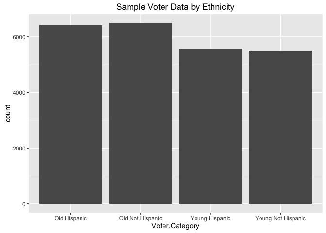

# 2016-0509 MSDS 6304-401 Week 8 Case Study
Chris Woodward, Bill Kerneckel, Claire Chu   
July 10, 2016  

<br>
                                                               


#### Problem Statement


The League of Women Voters asked PhD and Masters’ students enrolled in a statistical
consulting course in the Department of Statistical Science at SMU to help them
perform an experiment to determine whether sending either a postcard or a voter’s
guide (flyer) to potential voters increased the percent who actually voted in the 2014 election. The LWV was particularly interested in the effect on voting behavior among young and Hispanic voters, since this group tended to be less likely to vote in past elections.

The project spanned three semesters. In the spring of 2014, students estimated the
sample size needed for the study and developed the experimental design and
sampling methodology. In the fall of 2014, the data were gathered and cleaned, and inthe spring of 2015, the data were analyzed.

The sample consisted of 24,000 randomly selected individuals from a population of
531,735. The population was low-propensity voters, determined ahead of the 2014
election. A low propensity voter is someone who has only voted in 0 or 1 of the last
three elections. The sample was randomly partitioned into three treatment groups.

- 8000 received a postcard reminding them to vote
- 8000 received a flyer with a reminder and voting instructions
- 8000 did not receive any mailing. These are the control group.

After the 2014 election, information regarding voter participation was collected for all voters.

When the data were analyzed, it was found that 10% of the low propensity voters who
had received the flyer voted, approximately 12% of those who received the postcard
voted, and approximately 23% of the control group voted.

The LWV was not happy with these results, as they had expected that some sort of
reminder, whether a flyer or a postcard, would increase the chances of voting. The LWV asked the students to go back and examine the data. And guess what? There was a
problem. 

****************************

#### Assignment

You are to figure out the problem. There is a good (albeit subtle) reason that the
expectations do not match the results, and it can be found in the data. The reason has something to do with the topic for Unit 8, which is statistical sampling.

The LWV data is supplied to you in a CSV file and a SAS file. All that are required to figure out the problem are simple descriptive statistics and graphics that you have already encountered in the program. You may use either R or SAS to examine the data. You may also work in groups, as long as there are no more than three people in a group.

All you are to worry about is finding the problem itself. Do not worry about the remedy for the problem. It is somewhat complicated, and it will be discussed in the live session for Unit 10.

Your deliverable is a Word or Rmd document containing a well-written explanation for
the problem, along with any supporting graphics and tables. Your document should be
no more than two pages.

We will discuss the case study in Unit 10 live session.

****************************
#### Libary needed


```r
library(ggplot2)
```

****************************
#### Setting your working directory

In order for the analysis of thedatasets you must set your working directory to the following:


```r
setwd("/Users/wkerneck/desktop/Voter_Data/")
```

****************************

#### Table of Contents

- 1.0 [Import data](#id-section1)
- 1.1 [Alphabetic List of Variables and Attributes](#id-section2)
- 1.2 [Explorative Data Analysis (EDA)](#id-section3)
- 2.0 [Conclusion and Summary](#id-section4) 
- 3.0 [Acknowledgements](#id-section5) 

****************************
 
<div id='id-section1'/>
####  1.0 Import data

We have downloaded the data in a .CSV format. The .CSV file (LWV_Data.csv) was saved to the root of the project folder.

<strong>Orignal Voter Dataset:</strong>


```r
ImportedAsIsData <- read.table("LWV_Data.csv", header=TRUE, sep=",", na.strings=c("NA", "NULL"))
```

<strong>Removed NA's from Dataset:</strong>


```r
ImportedCleanedData <- ImportedAsIsData[complete.cases(ImportedAsIsData),]  #Removing all "NA" values from the dataset
```

<strong>Orginal Voter Dataset:</strong>

```r
dim(ImportedAsIsData)
```

```
## [1] 531735     27
```

```r
head(ImportedAsIsData, n=3)
```

```
##   VOTED2014 Young.Hispanic.Status ID.Number Voter.Status Voted.11.2012
## 1         0           non_y_non_h       186            A             0
## 2         0           non_y_non_h       669            A             0
## 3         0           non_y_non_h      1483            A             0
##   Voted.Gen..Elec..09.2010 Voted.Gen..Elec..07.2008
## 1                        0                        0
## 2                        0                        0
## 3                        0                        1
##   Number.General.Elections Hispanic.Surname Young.Voter Eligible.2012
## 1                        0                0           0             1
## 2                        0                0           0             1
## 3                        1                0           0             1
##   Eligible.2010 Eligible.2008 Young.in.2012 Young.in.2010 Young.in.2008
## 1             1             1             0             0             0
## 2             1             1             0             0             0
## 3             1             1             0             0             0
##     Voter.Category type   ID control post flyer LOWPROP       city   zip
## 1 Old Not Hispanic       186      NA   NA    NA       1     DALLAS 75230
## 2 Old Not Hispanic       669      NA   NA    NA       1     DALLAS 75229
## 3 Old Not Hispanic      1483      NA   NA    NA       1 CARROLLTON 75006
##   U_S__CONGRESS byear
## 1            24  1938
## 2            32  1953
## 3            24  1911
```

<strong>Sample Voter Dataset:</strong>

```r
dim(ImportedCleanedData)
```

```
## [1] 24000    27
```

```r
head(ImportedCleanedData, n=3)
```

```
##     VOTED2014 Young.Hispanic.Status ID.Number Voter.Status Voted.11.2012
## 39          0               non_y_h      5461            A             1
## 51          0               non_y_h      6832            A             0
## 217         0           non_y_non_h     16298            A             0
##     Voted.Gen..Elec..09.2010 Voted.Gen..Elec..07.2008
## 39                         0                        0
## 51                         0                        0
## 217                        0                        1
##     Number.General.Elections Hispanic.Surname Young.Voter Eligible.2012
## 39                         1                1           0             1
## 51                         0                1           0             1
## 217                        1                0           0             1
##     Eligible.2010 Eligible.2008 Young.in.2012 Young.in.2010 Young.in.2008
## 39              1             1             0             0             0
## 51              1             1             0             0             0
## 217             1             1             0             0             0
##       Voter.Category             type    ID control post flyer LOWPROP
## 39      Old Hispanic     Non_y_h_POST  5461       0    1     0       1
## 51      Old Hispanic     Non_y_h_POST  6832       0    1     0       1
## 217 Old Not Hispanic Non_y_non_h_POST 16298       0    1     0       1
##           city   zip U_S__CONGRESS byear
## 39  CARROLLTON 75007            24  1937
## 51  CARROLLTON 75006            24  1911
## 217    GARLAND 75042            32  1922
```

****************************

<div id='id-section2'/>
####  1.1 List of variables contained in each the dataset.


<strong>Orginal Voter Dataset:</strong>

```r
str(ImportedAsIsData)
```

```
## 'data.frame':	531735 obs. of  27 variables:
##  $ VOTED2014               : int  0 0 0 0 0 0 0 0 0 1 ...
##  $ Young.Hispanic.Status   : Factor w/ 4 levels "non_y_h","non_y_non_h",..: 2 2 2 2 2 2 2 2 2 2 ...
##  $ ID.Number               : int  186 669 1483 1527 1643 1882 2164 2499 2880 3020 ...
##  $ Voter.Status            : Factor w/ 1 level "A": 1 1 1 1 1 1 1 1 1 1 ...
##  $ Voted.11.2012           : int  0 0 0 0 0 0 0 0 0 1 ...
##  $ Voted.Gen..Elec..09.2010: int  0 0 0 0 0 0 0 0 0 0 ...
##  $ Voted.Gen..Elec..07.2008: int  0 0 1 1 0 0 1 1 1 0 ...
##  $ Number.General.Elections: int  0 0 1 1 0 0 1 1 1 1 ...
##  $ Hispanic.Surname        : int  0 0 0 0 0 0 0 0 0 0 ...
##  $ Young.Voter             : int  0 0 0 0 0 0 0 0 0 0 ...
##  $ Eligible.2012           : int  1 1 1 1 1 1 1 1 1 1 ...
##  $ Eligible.2010           : int  1 1 1 1 1 1 1 1 1 1 ...
##  $ Eligible.2008           : int  1 1 1 1 1 1 1 1 1 1 ...
##  $ Young.in.2012           : int  0 0 0 0 0 0 0 0 0 0 ...
##  $ Young.in.2010           : int  0 0 0 0 0 0 0 0 0 0 ...
##  $ Young.in.2008           : int  0 0 0 0 0 0 0 0 0 0 ...
##  $ Voter.Category          : Factor w/ 4 levels "Old Hispanic",..: 2 2 2 2 2 2 2 2 2 2 ...
##  $ type                    : Factor w/ 13 levels "","Non_y_h_CONTROL",..: 1 1 1 1 1 1 1 1 1 1 ...
##  $ ID                      : int  186 669 1483 1527 1643 1882 2164 2499 2880 3020 ...
##  $ control                 : int  NA NA NA NA NA NA NA NA NA NA ...
##  $ post                    : int  NA NA NA NA NA NA NA NA NA NA ...
##  $ flyer                   : int  NA NA NA NA NA NA NA NA NA NA ...
##  $ LOWPROP                 : int  1 1 1 1 1 1 1 1 1 1 ...
##  $ city                    : Factor w/ 28 levels "","ADDISON","BALCH SPRINGS",..: 7 7 4 4 6 4 7 4 4 10 ...
##  $ zip                     : int  75230 75229 75006 75006 75019 75006 75251 75006 75006 75234 ...
##  $ U_S__CONGRESS           : int  24 32 24 24 24 24 32 24 24 24 ...
##  $ byear                   : int  1938 1953 1911 1931 1948 1928 1926 1919 1924 1944 ...
```

<strong>Sample Voter Dataset:</strong>

```r
str(ImportedCleanedData)
```

```
## 'data.frame':	24000 obs. of  27 variables:
##  $ VOTED2014               : int  0 0 0 1 0 0 0 0 1 0 ...
##  $ Young.Hispanic.Status   : Factor w/ 4 levels "non_y_h","non_y_non_h",..: 1 1 2 1 2 2 2 2 2 2 ...
##  $ ID.Number               : int  5461 6832 16298 20802 23641 23821 25164 27016 28260 28523 ...
##  $ Voter.Status            : Factor w/ 1 level "A": 1 1 1 1 1 1 1 1 1 1 ...
##  $ Voted.11.2012           : int  1 0 0 0 0 0 0 0 0 0 ...
##  $ Voted.Gen..Elec..09.2010: int  0 0 0 0 1 0 0 1 0 0 ...
##  $ Voted.Gen..Elec..07.2008: int  0 0 1 1 0 1 1 0 0 0 ...
##  $ Number.General.Elections: int  1 0 1 1 1 1 1 1 0 0 ...
##  $ Hispanic.Surname        : int  1 1 0 1 0 0 0 0 0 0 ...
##  $ Young.Voter             : int  0 0 0 0 0 0 0 0 0 0 ...
##  $ Eligible.2012           : int  1 1 1 1 1 1 1 1 1 1 ...
##  $ Eligible.2010           : int  1 1 1 1 1 1 1 1 1 1 ...
##  $ Eligible.2008           : int  1 1 1 1 1 1 1 1 1 1 ...
##  $ Young.in.2012           : int  0 0 0 0 0 0 0 0 0 0 ...
##  $ Young.in.2010           : int  0 0 0 0 0 0 0 0 0 0 ...
##  $ Young.in.2008           : int  0 0 0 0 0 0 0 0 0 0 ...
##  $ Voter.Category          : Factor w/ 4 levels "Old Hispanic",..: 1 1 2 1 2 2 2 2 2 2 ...
##  $ type                    : Factor w/ 13 levels "","Non_y_h_CONTROL",..: 4 4 7 4 7 7 7 7 7 7 ...
##  $ ID                      : int  5461 6832 16298 20802 23641 23821 25164 27016 28260 28523 ...
##  $ control                 : int  0 0 0 0 0 0 0 0 0 0 ...
##  $ post                    : int  1 1 1 1 1 1 1 1 1 1 ...
##  $ flyer                   : int  0 0 0 0 0 0 0 0 0 0 ...
##  $ LOWPROP                 : int  1 1 1 1 1 1 1 1 1 1 ...
##  $ city                    : Factor w/ 28 levels "","ADDISON","BALCH SPRINGS",..: 4 4 12 12 12 12 12 12 12 12 ...
##  $ zip                     : int  75007 75006 75042 75040 75041 75041 75043 75040 75040 75040 ...
##  $ U_S__CONGRESS           : int  24 24 32 32 32 32 32 32 32 32 ...
##  $ byear                   : int  1937 1911 1922 1938 1911 1927 1926 1928 1944 1931 ...
```


****************************

<div id='id-section3'/>
####  1.2 Explorative Data Anaylsis (EDA)

Let's have a look at the summary and votes by ethnicity for each dataset so we can do some comparisons:

<strong>Orginal Voter Dataset:</strong>

```r
summary(ImportedAsIsData)
```

```
##    VOTED2014      Young.Hispanic.Status   ID.Number       Voter.Status
##  Min.   :0.0000   non_y_h    : 73380    Min.   :    186   A:531735    
##  1st Qu.:0.0000   non_y_non_h:295050    1st Qu.:3294584               
##  Median :0.0000   y_h        : 41739    Median :3857611               
##  Mean   :0.1468   y_non_h    :121566    Mean   :3520479               
##  3rd Qu.:0.0000                         3rd Qu.:4060678               
##  Max.   :1.0000                         Max.   :4216592               
##                                                                       
##  Voted.11.2012    Voted.Gen..Elec..09.2010 Voted.Gen..Elec..07.2008
##  Min.   :0.0000   Min.   :0.00000          Min.   :0.0000          
##  1st Qu.:0.0000   1st Qu.:0.00000          1st Qu.:0.0000          
##  Median :0.0000   Median :0.00000          Median :0.0000          
##  Mean   :0.2506   Mean   :0.01028          Mean   :0.1259          
##  3rd Qu.:1.0000   3rd Qu.:0.00000          3rd Qu.:0.0000          
##  Max.   :1.0000   Max.   :1.00000          Max.   :1.0000          
##                                                                    
##  Number.General.Elections Hispanic.Surname  Young.Voter    
##  Min.   :0.0000           Min.   :0.0000   Min.   :0.0000  
##  1st Qu.:0.0000           1st Qu.:0.0000   1st Qu.:0.0000  
##  Median :0.0000           Median :0.0000   Median :0.0000  
##  Mean   :0.3868           Mean   :0.2165   Mean   :0.3071  
##  3rd Qu.:1.0000           3rd Qu.:0.0000   3rd Qu.:1.0000  
##  Max.   :1.0000           Max.   :1.0000   Max.   :1.0000  
##                                                            
##  Eligible.2012    Eligible.2010    Eligible.2008    Young.in.2012   
##  Min.   :0.0000   Min.   :0.0000   Min.   :0.0000   Min.   :0.0000  
##  1st Qu.:0.0000   1st Qu.:0.0000   1st Qu.:0.0000   1st Qu.:0.0000  
##  Median :1.0000   Median :1.0000   Median :0.0000   Median :0.0000  
##  Mean   :0.7438   Mean   :0.5098   Mean   :0.4382   Mean   :0.3825  
##  3rd Qu.:1.0000   3rd Qu.:1.0000   3rd Qu.:1.0000   3rd Qu.:1.0000  
##  Max.   :1.0000   Max.   :1.0000   Max.   :1.0000   Max.   :1.0000  
##                                                                     
##  Young.in.2010    Young.in.2008               Voter.Category  
##  Min.   :0.0000   Min.   :0.0000   Old Hispanic      : 73380  
##  1st Qu.:0.0000   1st Qu.:0.0000   Old Not Hispanic  :295050  
##  Median :0.0000   Median :0.0000   Young Hispanic    : 41739  
##  Mean   :0.4281   Mean   :0.4685   Young Not Hispanic:121566  
##  3rd Qu.:1.0000   3rd Qu.:1.0000                              
##  Max.   :1.0000   Max.   :1.0000                              
##                                                               
##                   type              ID             control      
##                     :507735   Min.   :    186   Min.   :0.0     
##  Non_y_h_CONTROL    :  2000   1st Qu.:3294584   1st Qu.:0.0     
##  Non_y_h_FLYER      :  2000   Median :3857611   Median :0.0     
##  Non_y_h_POST       :  2000   Mean   :3520479   Mean   :0.3     
##  Non_y_non_h_CONTROL:  2000   3rd Qu.:4060678   3rd Qu.:1.0     
##  Non_y_non_h_FLYER  :  2000   Max.   :4216592   Max.   :1.0     
##  (Other)            : 14000                     NA's   :507735  
##       post            flyer           LOWPROP             city       
##  Min.   :0.0      Min.   :0.0      Min.   :1   DALLAS       :260590  
##  1st Qu.:0.0      1st Qu.:0.0      1st Qu.:1   GARLAND      : 49921  
##  Median :0.0      Median :0.0      Median :1   IRVING       : 43054  
##  Mean   :0.3      Mean   :0.3      Mean   :1   MESQUITE     : 31642  
##  3rd Qu.:1.0      3rd Qu.:1.0      3rd Qu.:1   GRAND PRAIRIE: 25632  
##  Max.   :1.0      Max.   :1.0      Max.   :1   RICHARDSON   : 17203  
##  NA's   :507735   NA's   :507735               (Other)      :103693  
##       zip        U_S__CONGRESS       byear     
##  Min.   :75001   Min.   : 5.00   Min.   :1898  
##  1st Qu.:75062   1st Qu.:24.00   1st Qu.:1961  
##  Median :75201   Median :30.00   Median :1976  
##  Mean   :75152   Mean   :26.98   Mean   :1972  
##  3rd Qu.:75224   3rd Qu.:32.00   3rd Qu.:1987  
##  Max.   :75287   Max.   :33.00   Max.   :1996  
##                                  NA's   :1
```


<strong>Sample Voter Dataset:</strong>

```r
summary(ImportedCleanedData)
```

```
##    VOTED2014      Young.Hispanic.Status   ID.Number       Voter.Status
##  Min.   :0.0000   non_y_h    :6416      Min.   :   5461   A:24000     
##  1st Qu.:0.0000   non_y_non_h:6499      1st Qu.:3410570               
##  Median :0.0000   y_h        :5584      Median :3870405               
##  Mean   :0.1238   y_non_h    :5501      Mean   :3604325               
##  3rd Qu.:0.0000                         3rd Qu.:4067789               
##  Max.   :1.0000                         Max.   :4216505               
##                                                                       
##  Voted.11.2012    Voted.Gen..Elec..09.2010 Voted.Gen..Elec..07.2008
##  Min.   :0.0000   Min.   :0.000000         Min.   :0.0000          
##  1st Qu.:0.0000   1st Qu.:0.000000         1st Qu.:0.0000          
##  Median :0.0000   Median :0.000000         Median :0.0000          
##  Mean   :0.2317   Mean   :0.009583         Mean   :0.1155          
##  3rd Qu.:0.0000   3rd Qu.:0.000000         3rd Qu.:0.0000          
##  Max.   :1.0000   Max.   :1.000000         Max.   :1.0000          
##                                                                    
##  Number.General.Elections Hispanic.Surname  Young.Voter    
##  Min.   :0.0000           Min.   :0.0      Min.   :0.0000  
##  1st Qu.:0.0000           1st Qu.:0.0      1st Qu.:0.0000  
##  Median :0.0000           Median :0.5      Median :0.0000  
##  Mean   :0.3568           Mean   :0.5      Mean   :0.4619  
##  3rd Qu.:1.0000           3rd Qu.:1.0      3rd Qu.:1.0000  
##  Max.   :1.0000           Max.   :1.0      Max.   :1.0000  
##                                                            
##  Eligible.2012    Eligible.2010    Eligible.2008    Young.in.2012 
##  Min.   :0.0000   Min.   :0.0000   Min.   :0.0000   Min.   :0.00  
##  1st Qu.:0.0000   1st Qu.:0.0000   1st Qu.:0.0000   1st Qu.:0.00  
##  Median :1.0000   Median :1.0000   Median :0.0000   Median :1.00  
##  Mean   :0.7338   Mean   :0.5009   Mean   :0.4216   Mean   :0.54  
##  3rd Qu.:1.0000   3rd Qu.:1.0000   3rd Qu.:1.0000   3rd Qu.:1.00  
##  Max.   :1.0000   Max.   :1.0000   Max.   :1.0000   Max.   :1.00  
##                                                                   
##  Young.in.2010    Young.in.2008               Voter.Category
##  Min.   :0.0000   Min.   :0.0000   Old Hispanic      :6416  
##  1st Qu.:0.0000   1st Qu.:0.0000   Old Not Hispanic  :6499  
##  Median :1.0000   Median :1.0000   Young Hispanic    :5584  
##  Mean   :0.5756   Mean   :0.6071   Young Not Hispanic:5501  
##  3rd Qu.:1.0000   3rd Qu.:1.0000                            
##  Max.   :1.0000   Max.   :1.0000                            
##                                                             
##                   type             ID             control      
##  Non_y_h_CONTROL    : 2000   Min.   :   5461   Min.   :0.0000  
##  Non_y_h_FLYER      : 2000   1st Qu.:3410570   1st Qu.:0.0000  
##  Non_y_h_POST       : 2000   Median :3870405   Median :0.0000  
##  Non_y_non_h_CONTROL: 2000   Mean   :3604325   Mean   :0.3333  
##  Non_y_non_h_FLYER  : 2000   3rd Qu.:4067789   3rd Qu.:1.0000  
##  Non_y_non_h_POST   : 2000   Max.   :4216505   Max.   :1.0000  
##  (Other)            :12000                                     
##       post            flyer           LOWPROP             city      
##  Min.   :0.0000   Min.   :0.0000   Min.   :1   DALLAS       :12271  
##  1st Qu.:0.0000   1st Qu.:0.0000   1st Qu.:1   GARLAND      : 2190  
##  Median :0.0000   Median :0.0000   Median :1   IRVING       : 1907  
##  Mean   :0.3333   Mean   :0.3333   Mean   :1   MESQUITE     : 1381  
##  3rd Qu.:1.0000   3rd Qu.:1.0000   3rd Qu.:1   GRAND PRAIRIE: 1333  
##  Max.   :1.0000   Max.   :1.0000   Max.   :1   RICHARDSON   :  657  
##                                                (Other)      : 4261  
##       zip        U_S__CONGRESS       byear     
##  Min.   :75001   Min.   : 5.00   Min.   :1908  
##  1st Qu.:75062   1st Qu.:30.00   1st Qu.:1967  
##  Median :75204   Median :30.00   Median :1984  
##  Mean   :75155   Mean   :27.21   Mean   :1977  
##  3rd Qu.:75223   3rd Qu.:32.00   3rd Qu.:1990  
##  Max.   :75254   Max.   :33.00   Max.   :1996  
## 
```


```r
ggplot(subset(ImportedAsIsData), aes(x=Voter.Category))+geom_bar(aes(y= ..count..), stat="count")+ggtitle("Orginal Voter Data by Ethnicity")
```

<!-- -->


```r
ggplot(subset(ImportedCleanedData), aes(x=Voter.Category))+geom_bar(aes(y= ..count..), stat="count")+ggtitle("Sample Voter Data by Ethnicity")
```

<!-- -->

****************************
<div id='id-section3'/>
#### 2.0 Conclusion and Summary

Clustering Error???
The sample is not representative of the population.

Display summary of catagories of demographics from population and compare it to the sample population. Under representative.


****************************
<div id='id-section4'/>
#### Acknowledgements

